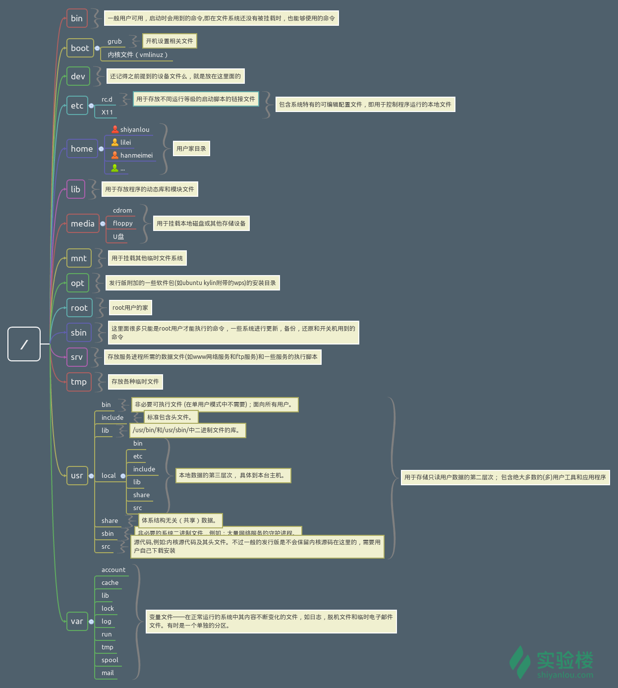

# linux基本命令

## 权限管理

### 用户管理
1. whoami: 查看当前登录用户名
2. who mom likes: 查看当前登录用户名及使用的终端
3. su <user>: 切换用户
4. sudo <cmd>: 以root权限执行命令， 前提是知道用户密码，且在sudo 用户组
5. passwd <用户名>: 修改用户密码
6. adduser <用户名>: 添加用户
7. 删除用户：deluser <用户名> --remove-home

### 用户组管理

1. 查看用户所属组： 
- groups <用户名>
- cat /etc/group | sort

2. sudo组文件存放位置: /etc/sudoers.d/
3. 添加用户组：usermod -G <用户组名> <用户名>

### 文件权限管理

1. 改变文件归属 chown <用户名> <文件名>
2. 修改文件访问权限 
- chmod <权限码> <文件名>
- chmod <gou+/-rwx> <文件名>


## 目录和文件的基本操作

1. 目录结构



2. 创建文件： touch <文件名>
3. 创建目录： mkdir <目录名>
4. 递归的创建目录： mkdir -p <目录名>
5. 复制文件： cp 文件名 目录
6. 复制目录： cp -R 目录 目录
7. 删除文件： rm 文件名
8. 删除目录： rm -r 目录
9. 移动文件和重命名： mv 文件名 目录或文件
10. 查看文件
- cat [-n] 文件名
- more 
- less
- tail [-n x -f] 文件名
- head [-n x] 文件名 
11. 查看文件类型： file 文件名

## 环境变量与文件查找

1. 配置文件~/.bashrc, ~/.profile; /etc/.profile
2. 重新加载配置文件 source ./.profile

### 搜索

1. whereis

简单快速， 只能搜索二进制文件(-b)， 帮助文件(-m)，和源代码(-s)

2. locate

快而全， 不是实时的， 通过/var/lib/mlocate/mlocate.db查找

3. which

小二精悍，搜索命令

4. find

最强大的查找命令

## 打包与压缩

### 文件后缀及其说明

<table>
<thead>
<tr>
<th>文件后缀名</th>
<th>说明</th>
</tr>
</thead>
<tbody><tr>
<td><code>*.zip</code></td>
<td>zip 程序打包压缩的文件</td>
</tr>
<tr>
<td><code>*.rar</code></td>
<td>rar 程序压缩的文件</td>
</tr>
<tr>
<td><code>*.7z</code></td>
<td>7zip 程序压缩的文件</td>
</tr>
<tr>
<td><code>*.tar</code></td>
<td>tar 程序打包，未压缩的文件</td>
</tr>
<tr>
<td><code>*.gz</code></td>
<td>gzip 程序（GNU zip）压缩的文件</td>
</tr>
<tr>
<td><code>*.xz</code></td>
<td>xz 程序压缩的文件</td>
</tr>
<tr>
<td><code>*.bz2</code></td>
<td>bzip2 程序压缩的文件</td>
</tr>
<tr>
<td><code>*.tar.gz</code></td>
<td>tar 打包，gzip 程序压缩的文件</td>
</tr>
<tr>
<td><code>*.tar.xz</code></td>
<td>tar 打包，xz 程序压缩的文件</td>
</tr>
<tr>
<td><code>*tar.bz2</code></td>
<td>tar 打包，bzip2 程序压缩的文件</td>
</tr>
<tr>
<td><code>*.tar.7z</code></td>
<td>tar 打包，7z 程序压缩的文件</td>
</tr>
</tbody></table>

以上来自[实验楼](https://www.shiyanlou.com/courses/1/learning/?id=61)

### zip命令

- -r：递归打包子目录
- -q: 安静模式
- -o: 输出文件
- -数字 1-9： 压缩级别
- -x: 要排除的文件或目录

### unzip命令

- -q: 安静模式
- -d: 指定解压到哪个目录
- -l: 查看包内容
- -O: 指定编码类型

### tar命令

```
$ tar -P -cf shiyanlou.tar /home/shiyanlou/Desktop
$ tar -xf shiyanlou.tar -C tardir
```
- -P: 保留绝对路径符号
- -c: 表示创建一个tar文件
- -f: 指定创建的文件名
- -x: 解包文件
- -C: 指定解包出来文件的目录
- -v: 看到过程
- -t: 查看包内容而不解包
- -p: 保留文件属性
- -h: 备份链接指向的源文件而不是链接本身
- -z: 表示gzip压缩

压缩格式和参数对应关系

<table>
<thead>
<tr>
<th>压缩文件格式</th>
<th>参数</th>
</tr>
</thead>
<tbody><tr>
<td><code>*.tar.gz</code></td>
<td><code>-z</code></td>
</tr>
<tr>
<td><code>*.tar.xz</code></td>
<td><code>-J</code></td>
</tr>
<tr>
<td><code>*tar.bz2</code></td>
<td><code>-j</code></td>
</tr>
</tbody></table>

## 文件系统操作与磁盘管理

1. df命令

用户查看磁盘容量

- -h: 以便于阅读的方式输出size

2. du命令

```
du -h  -d 0 ~
```
- -h 友好输出
- -d 查看层级
- -a 显示所有文件大小
- -s 只显示汇总的大小

## linux的帮助命令

### help

显示内建命令的帮助信息

### man命令

## 命令执行顺序与管道

1. 可以用;分割命令，简单顺序执行
```
$ sudo apt-get update;sudo apt-get install some-tool;some-tool
# 让它自己运行
```

2. 条件执行命令

```
$ which cowsay>/dev/null && echo "exist" || echo "not exist"
```

3. 管道| 

管道就是将一个命令的输出作为另一个命令的输入

```
$ ls -al /etc | less
```
4. cut命令

按行切分

<p>打印<code>/etc/passwd</code>文件中以<code>:</code>为分隔符的第1个字段和第6个字段分别表示用户名和其家目录：</p>
```
$ cut /etc/passwd -d ':' -f 1,6
```

<p>打印<code>/etc/passwd</code>文件中每一行的前N个字符：</p>

```
$ cut /etc/passwd -c -5
```

5. grep命令

在文本中或stdin中查找匹配字符串

```
$ grep -rnI "shiyanlou" ~
```

- -r 递归查找子目录
- -n 打印匹配项行号
- -I 忽略二进制文件

6. wc

一个小巧的计数命令

```
# 行数
$ wc -l /etc/passwd
# 单词数
$ wc -w /etc/passwd
# 字节数
$ wc -c /etc/passwd
# 字符数
$ wc -m /etc/passwd
# 最长行字节数
$ wc -L /etc/passwd
```

7. sort排序

- 字典序

```
$ cat /etc/passwd | sort
```

- 排序反转

```
$ cat /etc/passwd | sort -r
```

- 按指定字段排序

```
$ cat /etc/passwd | sort -t':' -k 3
```

- -t: 用于指定字段分隔符
- -k: 字段号
- -n: 数字排序

8. uniq

去重

## 文本处理

1. tr

<table>
<thead>
<tr>
<th>选项</th>
<th>说明</th>
</tr>
</thead>
<tbody><tr>
<td><code>-d</code></td>
<td>删除和set1匹配的字符，注意不是全词匹配也不是按字符顺序匹配</td>
</tr>
<tr>
<td><code>-s</code></td>
<td>去除set1指定的在输入文本中连续并重复的字符</td>
</tr>
</tbody></table>

2. col

tab与空格互换

<table>
<thead>
<tr>
<th>选项</th>
<th>说明</th>
</tr>
</thead>
<tbody><tr>
<td><code>-x</code></td>
<td>将<code>Tab</code>转换为空格</td>
</tr>
<tr>
<td><code>-h</code></td>
<td>将空格转换为<code>Tab</code>（默认选项）</td>
</tr>
</tbody></table>

3. join 合并

<table>
<thead>
<tr>
<th>选项</th>
<th>说明</th>
</tr>
</thead>
<tbody><tr>
<td><code>-t</code></td>
<td>指定分隔符，默认为空格</td>
</tr>
<tr>
<td><code>-i</code></td>
<td>忽略大小写的差异</td>
</tr>
<tr>
<td><code>-1</code></td>
<td>指明第一个文件要用哪个字段来对比，默认对比第一个字段</td>
</tr>
<tr>
<td><code>-2</code></td>
<td>指明第二个文件要用哪个字段来对比，默认对比第一个字段</td>
</tr>
</tbody></table>

4. paste

paste与join类似， 只是不比较直接合并

## 数据流重定向

```
echo 'hello' >> redirect
```

<table>
<thead>
<tr>
<th>文件描述符</th>
<th>设备文件</th>
<th>说明</th>
</tr>
</thead>
<tbody><tr>
<td><code>0</code></td>
<td><code>/dev/stdin</code></td>
<td>标准输入</td>
</tr>
<tr>
<td><code>1</code></td>
<td><code>/dev/stdout</code></td>
<td>标准输出</td>
</tr>
<tr>
<td><code>2</code></td>
<td><code>/dev/stderr</code></td>
<td>标准错误</td>
</tr>
</tbody></table>

```
# 将标准错误重定向到标准输出，再将标准输出重定向到文件，注意要将重定向到文件写到前面
$ cat Documents/test.c hello.c >somefile  2>&1
# 或者只用bash提供的特殊的重定向符号"&"将标准错误和标准输出同时重定向到文件
$ cat Documents/test.c hello.c &>somefilehell
```

```
$ echo 'hello shiyanlou' | tee hello
```
同时重定向到文件和屏幕


永久重定向

```
# 使用exec替换当前进程的重定向，将标准输出重定向到一个文件
$ exec 1>somefile
# 后面你执行的命令的输出都将被重定向到文件中,直到你退出当前子shell，或取消exec的重定向（后面将告诉你怎么做）
```


